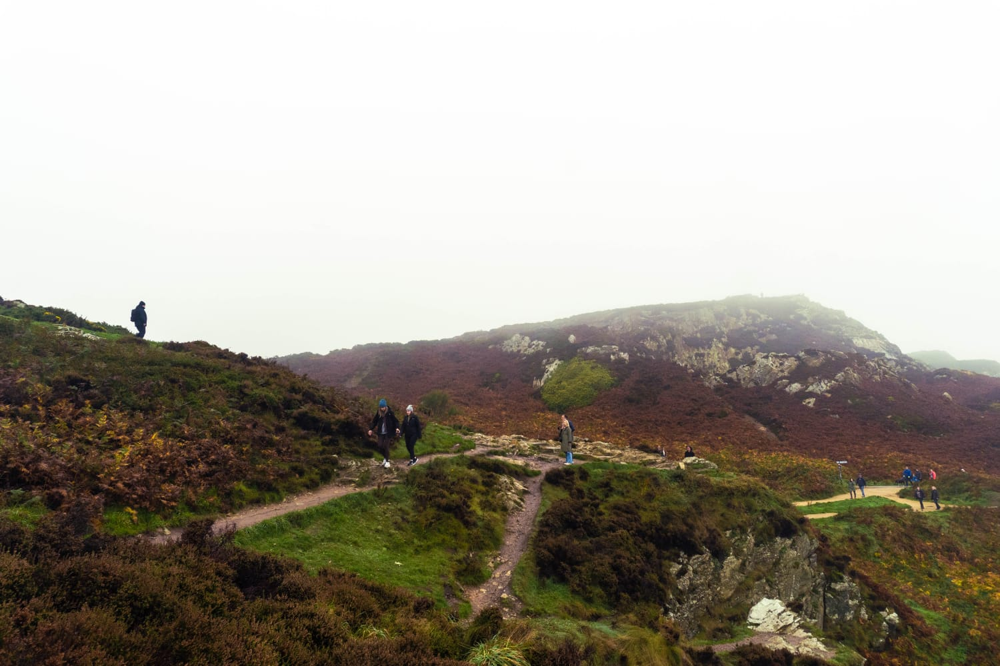
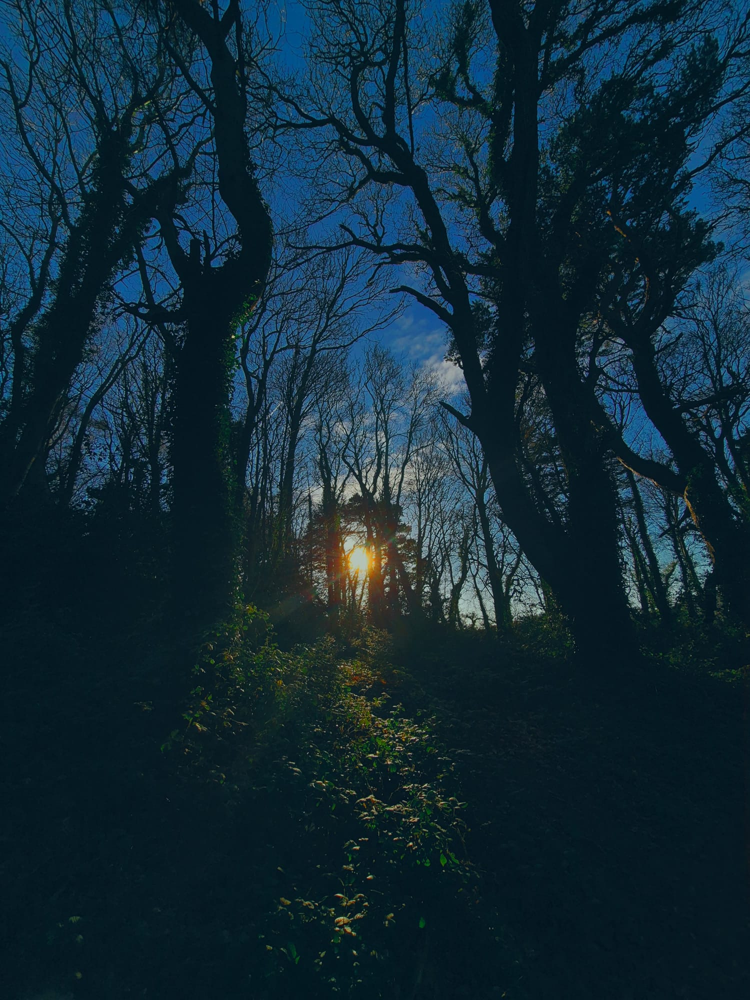
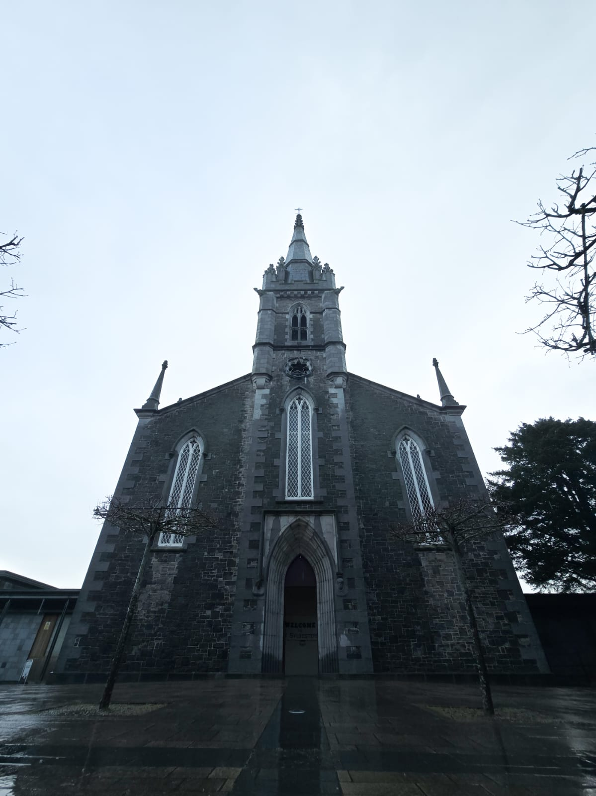
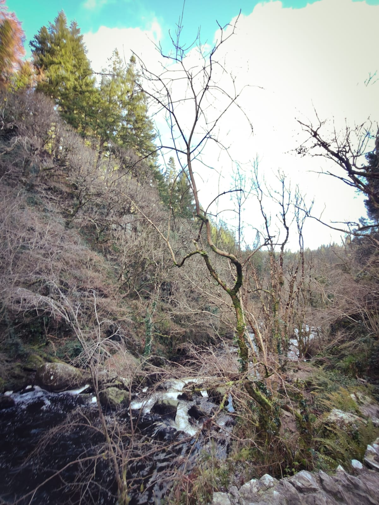
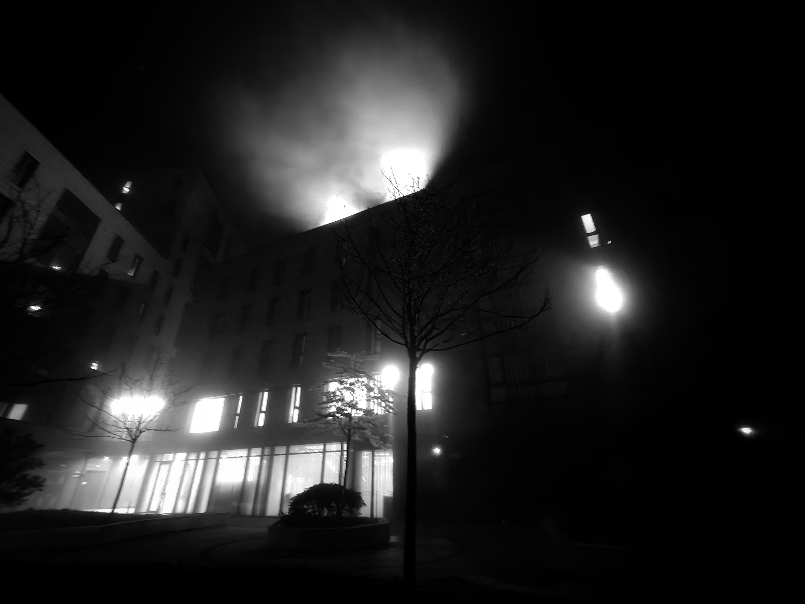
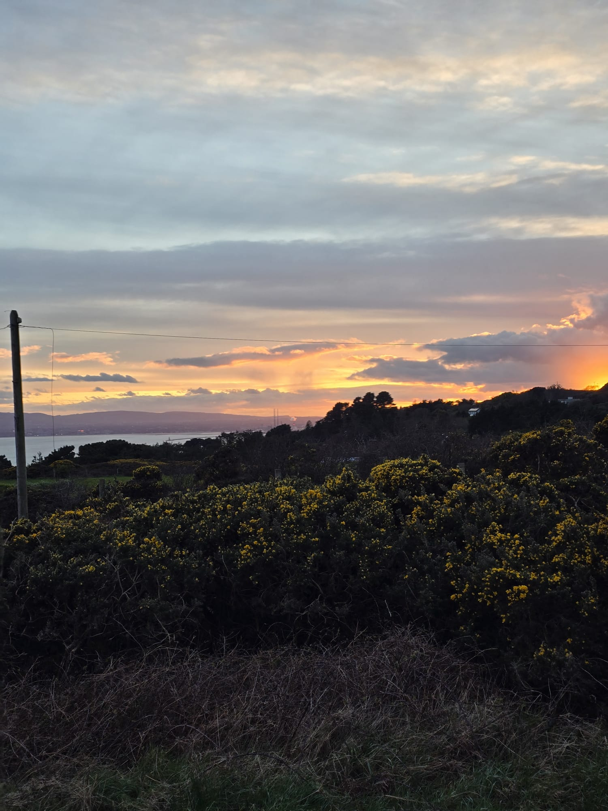
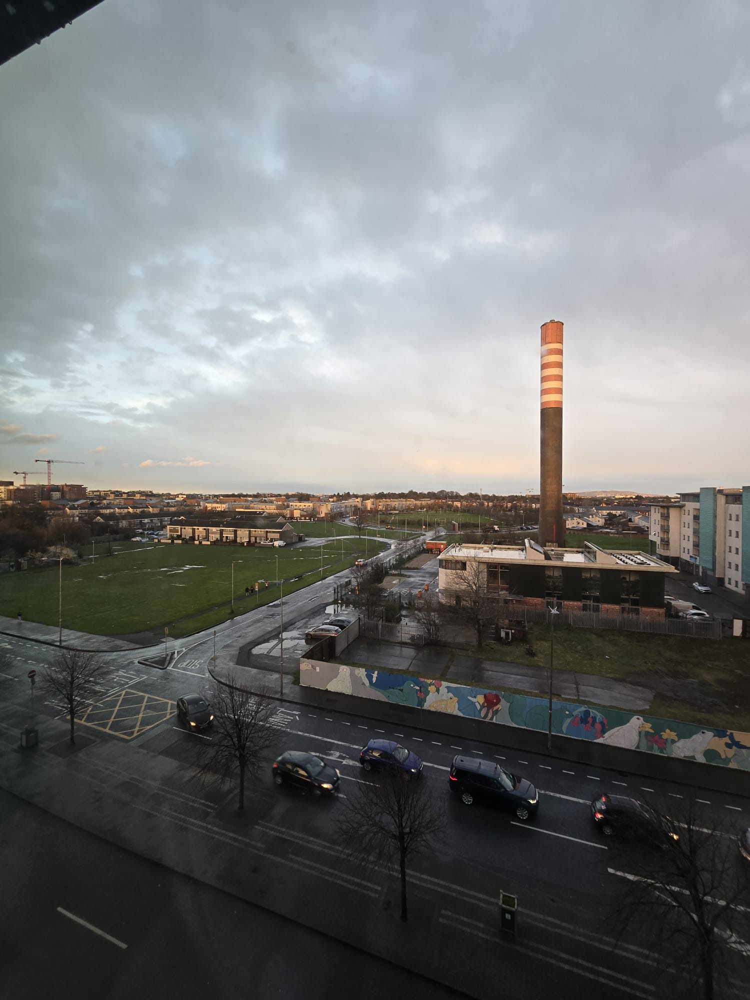
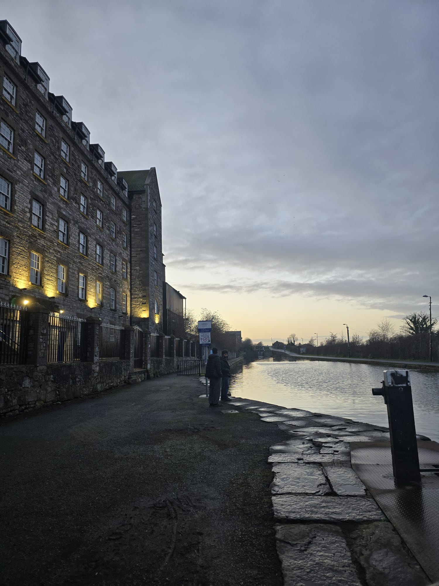

```{=html}
<nav id="site-nav">
  <a href="#hero">Home</a>
  <a href="#story" class="sm-hide">Story</a>
  <a href="#skills" class="sm-hide">Skills</a>
  <a href="#projects">Projects</a>
  <a href="#hobbies" class="sm-hide">Hobbies</a>
  <a href="#gallery">Gallery</a>
  <a href="#contact">Contact</a>
</nav>

<section id="hero">
  <div style="max-width:700px;">
    <p class="sec-label fade d1">Portfolio · MSc Business Analytics · DCU</p>
    <h1 class="name-display fade d2">Tanishq<br>Katheriya</h1>
    <p class="tagline fade d3">From Bhopal to Dublin — data, cooking, and a spontaneous leap.</p>
    <p class="fade d4" style="margin-top:1.2rem;font-size:0.92rem;max-width:440px;color:var(--muted);">
      International student · Home chef · Perpetual learner
    </p>
    <!-- Spotify-style music player -->
    <div id="spotify-player" class="glass fade d5">
      <div id="sp-track-info">
        <div id="sp-track-icon">🎵</div>
        <div id="sp-track-text">
          <div id="sp-track-name">Lofi Beats to Chill and Focus</div>
          <div id="sp-track-sub">Music to Chill &amp; Focus</div>
        </div>
      </div>
      <div id="sp-controls">
        <button id="sp-prev" title="Previous">⏮</button>
        <button id="sp-play" title="Play / Pause">▶</button>
        <button id="sp-next" title="Next">⏭</button>
      </div>
      <div id="sp-right">
        <span id="sp-time">0:00</span>
        <input type="range" id="sp-vol" min="0" max="1" step="0.05" value="0.45" title="Volume">
        <span style="font-size:0.8rem;">🔊</span>
      </div>
      <!-- Hidden audio element for local tracks -->
      <audio id="wave-audio" preload="none">
        <source src="sounds/waves.mp3" type="audio/mpeg">
      </audio>
    </div>

    <!-- Rain video — visible floating window, shown when that track is active -->
    <div id="yt-window" class="glass fade d5" style="display:none; margin-top:1rem; max-width:520px; border-radius:20px; overflow:hidden; position:relative;">
      <div style="background:rgba(0,0,0,0.4); padding:0.5rem 1rem; display:flex; align-items:center; gap:0.6rem; border-bottom:1px solid var(--border-c);">
        <span style="font-size:0.9rem;">🌧️</span>
        <span style="font-size:0.78rem; color:var(--text-2); font-family:'DM Sans',sans-serif; letter-spacing:0.04em;">Rain to Study To · Music to Chill &amp; Focus</span>
      </div>
      <div style="position:relative; padding-bottom:56.25%; height:0; overflow:hidden;">
        <iframe id="yt-iframe"
          style="position:absolute;top:0;left:0;width:100%;height:100%;border:none;"
          allow="autoplay; encrypted-media"
          allowfullscreen
          src="about:blank">
        </iframe>
      </div>
    </div>
  </div>
  <div id="sun-moon-container" style="position:absolute;top:0;left:0;width:100%;height:100%;z-index:0;pointer-events:none;"></div>
  <script src="https://cdnjs.cloudflare.com/ajax/libs/three.js/r128/three.min.js"></script>
</section>

<section id="story">
<div class="dk-wrap">
  <p class="sec-label">My Journey</p>
  <h2 class="sec-title">From Bhopal to Dublin</h2>
  <div style="display:flex;flex-direction:column;gap:1.5rem;margin-top:1.5rem;">
    <div class="glass" style="padding:1.5rem;border-radius:20px;">
      <div style="font-size:1.8rem;margin-bottom:0.5rem;">🎯</div>
      <div style="font-weight:700;font-size:1.2rem;margin-bottom:0.5rem;">The Secret Leap</div>
      <p style="margin:0;line-height:1.5;">Last semester in Bhopal, I decided to study abroad – and told no one. I researched forums, consultancies, Reddit, prepared for IELTS in secret. When I finally passed and got offers from Maynooth and DCU, I told my family. They were shocked, then happy. That conversation changed everything.</p>
    </div>
    <div class="glass" style="padding:1.5rem;border-radius:20px;">
      <div style="font-size:1.8rem;margin-bottom:0.5rem;">🌊</div>
      <div style="font-weight:700;font-size:1.2rem;margin-bottom:0.5rem;">Dublin Days & 1am Street Music</div>
      <p style="margin:0;line-height:1.5;">September 2025 – I landed at DCU, moved into Aspen, made friends from everywhere. Late nights, gaming, random chats. We travelled to Howth, Bray, Malahide. One night at 1am, we found street musicians playing drums and guitar – my friend grabbed the guitar and joined them. I filmed it. That was the real Ireland.</p>
    </div>
    <div class="glass" style="padding:1.5rem;border-radius:20px;">
      <div style="font-size:1.8rem;margin-bottom:0.5rem;">🍳</div>
      <div style="font-weight:700;font-size:1.2rem;margin-bottom:0.5rem;">Shyness, Cooking, and Calling Home</div>
      <p style="margin:0;line-height:1.5;">I was always the quiet one in meetings. But I pushed myself into seminars, guest lectures, presentations. It was terrifying – but I did it. Cooking is my anchor: butter chicken, gulab jamuns from bread, whatever reminds me of home. My friends say it's restaurant quality. I call my parents every night. That keeps me grounded.</p>
    </div>
  </div>
</div>
</section>

<hr class="dk-hr">

<section id="skills">
<div class="dk-wrap">
  <p class="sec-label">What I Can Do</p>
  <h2 class="sec-title">Skills & Tools</h2>
  <div style="display:flex;flex-wrap:wrap;gap:1rem;margin-top:1.5rem;">
    <div class="glass" style="padding:0.8rem 1.5rem;border-radius:40px;">Python (basic, with assistance)</div>
    <div class="glass" style="padding:0.8rem 1.5rem;border-radius:40px;">Power BI (dashboards)</div>
    <div class="glass" style="padding:0.8rem 1.5rem;border-radius:40px;">SQL (basic queries)</div>
    <div class="glass" style="padding:0.8rem 1.5rem;border-radius:40px;">Quarto (this website)</div>
    <div class="glass" style="padding:0.8rem 1.5rem;border-radius:40px;">Excel (advanced analytics)</div>
    <div class="glass" style="padding:0.8rem 1.5rem;border-radius:40px;">AI‑assisted development</div>
  </div>
</div>
</section>

<hr class="dk-hr">

<section id="projects">
<div class="dk-wrap">
  <p class="sec-label">Work I've Done</p>
  <h2 class="sec-title">Projects</h2>
  <div style="display:flex;flex-direction:column;gap:1.5rem;margin-top:1.5rem;">
    <div class="glass" style="padding:1.8rem;border-radius:24px;">
      <div style="display:flex;align-items:center;gap:0.8rem;margin-bottom:0.8rem;"><span style="font-size:2rem;">🏘️</span><span style="font-weight:700;font-size:1.3rem;">Killala Town Analysis</span></div>
      <p style="margin:0;line-height:1.5;">Group project (4-5 members). Researched and analyzed a small Irish town – its economy, tourism, infrastructure. We predicted future outcomes and suggested actionable strategies to attract more visitors and improve local life. My role: data collection and presentation.</p>
    </div>
    <div class="glass" style="padding:1.8rem;border-radius:24px;">
      <div style="display:flex;align-items:center;gap:0.8rem;margin-bottom:0.8rem;"><span style="font-size:2rem;">🤖</span><span style="font-weight:700;font-size:1.3rem;">Gen AI vs BERT</span></div>
      <p style="margin:0;line-height:1.5;">Semester 2 project. Used Amazon retail data to compare Generative AI and BERT models. Ran both locally with Ollama and VS Code. Evaluated using accuracy, recall, F1 score – Gen AI won. Learned about model evaluation and local deployment.</p>
    </div>
    <div class="glass" style="padding:1.8rem;border-radius:24px;">
      <div style="display:flex;align-items:center;gap:0.8rem;margin-bottom:0.8rem;"><span style="font-size:2rem;">📡</span><span style="font-weight:700;font-size:1.3rem;">Gorey IoT Practicum</span></div>
      <p style="margin:0;line-height:1.5;">Current major project. Using IoT sensor data (traffic, footfall) to predict congestion and pollution one hour ahead. Building an ML model with Python and scikit-learn. The goal is to help the town manage crowds and air quality in real time.</p>
    </div>
    <div class="glass" style="padding:1.8rem;border-radius:24px;">
      <div style="display:flex;align-items:center;gap:0.8rem;margin-bottom:0.8rem;"><span style="font-size:2rem;">⚽</span><span style="font-weight:700;font-size:1.3rem;">FAI Women's National Team Project</span></div>
      <p style="margin:0;line-height:1.5;">Client project for the Football Association of Ireland. Analyzed organisational issues, conducted surveys, and provided recommendations to support the women's national team. Delivered reports and a final presentation to FAI stakeholders.</p>
    </div>
    <div class="glass" style="padding:1.8rem;border-radius:24px;">
      <div style="display:flex;align-items:center;gap:0.8rem;margin-bottom:0.8rem;"><span style="font-size:2rem;">📊</span><span style="font-weight:700;font-size:1.3rem;">Hypothetical Company Analysis</span></div>
      <p style="margin:0;line-height:1.5;">Business analytics project. Used a large Excel dataset to model a company's performance over 10-30 years. Predicted success/failure and recommended strategic changes. Built Power BI dashboards to visualise trends.</p>
    </div>
    <div class="glass" style="padding:1.8rem;border-radius:24px;">
      <div style="display:flex;align-items:center;gap:0.8rem;margin-bottom:0.8rem;"><span style="font-size:2rem;">🥽</span><span style="font-weight:700;font-size:1.3rem;">VR Reflection Experience</span></div>
      <p style="margin:0;line-height:1.5;">Unique VR simulation – a business meeting with a virtual manager. I had to argue for a strategic decision under pressure. It pushed me out of my comfort zone and taught me to think on my feet. A truly memorable experience.</p>
    </div>
    <div class="glass" style="padding:1.8rem;border-radius:24px;">
      <div style="display:flex;align-items:center;gap:0.8rem;margin-bottom:0.8rem;"><span style="font-size:2rem;">🌐</span><span style="font-weight:700;font-size:1.3rem;">This e‑portfolio</span></div>
      <p style="margin:0;line-height:1.5;">Designed and built this Quarto website from scratch. Researched GitHub Pages, glassmorphism CSS, Three.js, and wave audio integration. Personalised every section. A learning journey in itself.</p>
    </div>
  </div>
</div>
</section>

<section id="certs">
<div class="dk-wrap">
  <p class="sec-label">Credentials</p>
  <h2 class="sec-title">Certifications &amp; Achievements</h2>
  <div class="cert-list">
    <div class="glass cert-item">
      <span class="cert-icon">🤝</span>
      <div><div class="cert-name">Lifetime NGO Membership</div><p class="cert-desc">Awarded lifetime membership with an NGO in my hometown — recognition for sustained community involvement.</p></div>
    </div>
    <div class="glass cert-item">
      <span class="cert-icon">🏅</span>
      <div><div class="cert-name">Team Lead Certificate — Digital Marketing Startup</div><p class="cert-desc">Led a team at a digital marketing startup in a hectic, fast-moving environment. My first real leadership experience.</p></div>
    </div>
    <div class="glass cert-item">
      <span class="cert-icon">💻</span>
      <div><div class="cert-name">Internship Certificate — ACMEGRADE</div><p class="cert-desc">Completed a web development internship course and received a formal certificate from ACMEGRADE. My introduction to building for the web.</p></div>
    </div>
    <div class="glass cert-item">
      <span class="cert-icon">⌨️</span>
      <div><div class="cert-name">C++ Completion Certificate</div><p class="cert-desc">Completed a structured C++ programming course — my first exposure to coding logic and computational thinking.</p></div>
    </div>
  </div>
</div>
</section>

<hr class="dk-hr">

<section id="hobbies">
<div class="dk-wrap">
  <p class="sec-label">Life Beyond Data</p>
  <h2 class="sec-title">Hobbies</h2>
  <div class="hobby-grid">
    <div class="glass hobby-card wide">
      <div class="hobby-emoji">🍳</div>
      <div class="hobby-title">Cooking</div>
      <p>Cooking is my main passion — genuinely, not just as something to say. It started in 4th grade, learning from my parents and YouTube, and has never stopped. I experiment constantly: I once recreated the exact flavour of a crisp packet from scratch by layering seasonings until it matched. My friends say it's restaurant-quality. I'm not sure I believe them, but I cook for taste, not for photos.</p>
      <p style="margin-top:0.8em;">I make butter chicken, pasta, sandwiches on a regular basis. My favourite experiment: gulab jamuns made with bread instead of traditional khoya — it sounds wrong, it tastes right. I've also made puff pastries from scratch: awkward the first time, edible and actually good. I once wrote a whole personal cookbook. I lost it. That's the real tragedy.</p>
    </div>
    <div class="glass hobby-card">
      <div class="hobby-emoji">🌊</div>
      <div class="hobby-title">Travelling</div>
      <p>I love peaceful places — especially coastlines. Since arriving in Dublin I've explored Howth, Bray, Malahide, Wicklow, and wandered through Trinity College and the city centre. Each place has left a different, quiet impression. The Irish coast has a particular calm I wasn't expecting.</p>
    </div>
    <div class="glass hobby-card">
      <div class="hobby-emoji">✏️</div>
      <div class="hobby-title">Sketching</div>
      <p>I draw live portraits and abstract pieces. It's a way of slowing down and noticing — shapes, proportions, the way light falls on a face. I don't share much of it, but it's a consistent part of how I spend quiet evenings.</p>
    </div>
    <div class="glass hobby-card">
      <div class="hobby-emoji">🎮</div>
      <div class="hobby-title">Gaming</div>
      <p>Puzzle and mystery games, especially co-op. There's something satisfying about games that require thinking and communication in equal measure. Also a reliable excuse for late-night sessions with friends from Aspen.</p>
    </div>
  </div>
</div>
</section>

<hr class="dk-hr">

<section id="journal">
<div class="dk-wrap">
  <p class="sec-label">Places &amp; Memories</p>
  <h2 class="sec-title">Coastal Journal</h2>
  <p style="margin-top:0.6rem;color:var(--muted);max-width:520px;font-size:0.88rem;">A running log of places I've been since arriving in Dublin — each with a small memory attached.</p>
  <div style="display:grid;grid-template-columns:repeat(auto-fill,minmax(300px,1fr));gap:1.5rem;margin-top:1.5rem;">
    <div class="glass" style="padding:1.2rem;border-radius:20px;overflow:hidden;">
      
      <div style="font-weight:700;font-size:1.2rem;margin-bottom:0.3rem;">Howth</div>
      <p style="margin:0;line-height:1.5;">Windy cliffs, the smell of salt and fish and chips, and a sunset that lasted longer than I expected.</p>
    </div>
    <div class="glass" style="padding:1.2rem;border-radius:20px;overflow:hidden;">
      
      <div style="font-weight:700;font-size:1.2rem;margin-bottom:0.3rem;">Bray</div>
      <p style="margin:0;line-height:1.5;">The seaside promenade on a quiet afternoon, sweet shops tucked into side streets, and the kind of long conversation that only happens when you have nowhere else to be.</p>
    </div>
    <div class="glass" style="padding:1.2rem;border-radius:20px;overflow:hidden;">
      
      <div style="font-weight:700;font-size:1.2rem;margin-bottom:0.3rem;">Malahide</div>
      <p style="margin:0;line-height:1.5;">Castle gardens and a quiet marina. Coffee by the water on a grey morning. Malahide has a pace that makes Dublin feel very far away.</p>
    </div>
    <div class="glass" style="padding:1.2rem;border-radius:20px;overflow:hidden;">
      
      <div style="font-weight:700;font-size:1.2rem;margin-bottom:0.3rem;">Devil's Glen, Wicklow</div>
      <p style="margin:0;line-height:1.5;">Mountains and lakes in the same frame — it genuinely felt like another world. Windswept and slightly muddy, but worth every step.</p>
    </div>
    <div class="glass" style="padding:1.2rem;border-radius:20px;overflow:hidden;">
      
      <div style="font-weight:700;font-size:1.2rem;margin-bottom:0.3rem;">Aspen (Home Away From Home)</div>
      <p style="margin:0;line-height:1.5;">My accommodation at DCU. Late-night study sessions, kitchen experiments at odd hours, and conversations that started about assignments and ended about life.</p>
    </div>
  </div>
</div>
</section>

<hr class="dk-hr">

<section id="sunsets">
<div class="dk-wrap">
  <p class="sec-label">Golden Hours</p>
  <h2 class="sec-title">Sunsets</h2>
  <div style="display:grid;grid-template-columns:repeat(auto-fill,minmax(220px,1fr));gap:1rem;margin-top:1.5rem;">
    <div class="glass sunset-card"></div>
    <div class="glass sunset-card"></div>
    <div class="glass sunset-card"></div>
    <div class="glass sunset-card"></div>
  </div>
</div>
</section>

<hr class="dk-hr">

<section id="gallery">
<div class="dk-wrap">
  <p class="sec-label">Media</p>
  <h2 class="sec-title">Gallery</h2>

  <div class="tab-row" style="margin-top:2rem;">
    <button class="tab-btn on" onclick="showTab('images',this)">📷 Images</button>
    <button class="tab-btn" onclick="showTab('video',this)">🎬 Video</button>
    <button class="tab-btn" onclick="showTab('audio',this)">🎵 Audio</button>
    <button class="tab-btn" onclick="showTab('docs',this)">📄 Documents</button>
    <button class="tab-btn" onclick="showTab('links',this)">🔗 Links</button>
  </div>

  <div id="tab-images" class="tab-pane on">
    <div class="gallery-grid">
      <div class="gallery-thumb glass"><div class="gallery-label">Howth</div></div>
      <div class="gallery-thumb glass"><div class="gallery-label">Bray</div></div>
      <div class="gallery-thumb glass"><div class="gallery-label">Malahide</div></div>
      <div class="gallery-thumb glass"><div class="gallery-label">Devil's Glen</div></div>
      <div class="gallery-thumb glass"><div class="gallery-label">Aspen, DCU</div></div>
      <div class="gallery-thumb glass"><div class="gallery-label">Sunset I</div></div>
      <div class="gallery-thumb glass"><div class="gallery-label">Sunset II</div></div>
      <div class="gallery-thumb glass"><div class="gallery-label">Sunset III</div></div>
      <div class="gallery-thumb glass"><div class="gallery-label">Sunset IV</div></div>
    </div>
  </div>

  <div id="tab-video" class="tab-pane">
    <div class="glass" style="padding:1.5rem;border-radius:16px;">
      <div style="font-family:'Cormorant Garamond',serif;font-size:1.3rem;color:var(--text-1);margin-bottom:1rem;">🍳 Kitchen Experiments</div>
      <video controls style="width:100%;max-width:800px;border-radius:12px;">
        <source src="media/kitchen-drone.mp4" type="video/mp4">
        Your browser doesn't support video.
      </video>
    </div>
  </div>

  <div id="tab-audio" class="tab-pane">
    <div class="glass" style="padding:2rem;border-radius:16px;">
      <div style="font-family:'Cormorant Garamond',serif;font-size:1.3rem;color:var(--text-1);margin-bottom:1.2rem;">🎵 Music to Chill &amp; Focus</div>
      <p style="font-size:0.85rem;color:var(--muted);margin-bottom:1.2rem;">Use the player on the home screen to control playback. Two tracks available:</p>
      <div style="display:flex;flex-direction:column;gap:0.8rem;">
        <div class="glass" style="display:flex;align-items:center;gap:1rem;padding:0.9rem 1.2rem;border-radius:40px;">
          <span style="font-size:1.3rem;">🌊</span>
          <div>
            <div style="font-size:0.88rem;color:var(--text-1);font-weight:500;">Lofi Beats to Chill and Focus</div>
            <div style="font-size:0.72rem;color:var(--muted);">Local · waves.mp3</div>
          </div>
        </div>
        <div class="glass" style="display:flex;align-items:center;gap:1rem;padding:0.9rem 1.2rem;border-radius:40px;">
          <span style="font-size:1.3rem;">🌧️</span>
          <div>
            <div style="font-size:0.88rem;color:var(--text-1);font-weight:500;">Rain to Study To</div>
            <div style="font-size:0.72rem;color:var(--muted);">YouTube · q76bMs-NwRk</div>
          </div>
          <a href="https://youtu.be/q76bMs-NwRk" target="_blank" style="margin-left:auto;font-size:0.72rem;color:var(--accent);text-decoration:none;">Open ↗</a>
        </div>
      </div>
    </div>
  </div>

  <div id="tab-docs" class="tab-pane">
    <div class="glass doc-row">
      <span style="font-size:1.5rem;">📄</span>
      <div>
        <div style="font-family:'Cormorant Garamond',serif;font-size:1.15rem;color:var(--text-1);">Resume / CV</div>
        <p style="font-size:0.82rem;color:var(--muted);margin:0;">Tanishq Katheriya — MSc Business Analytics, DCU</p>
      </div>
      <a href="docs/resume.pdf" class="glass ext-link" download="Tanishq_Katheriya_CV.pdf"> Download</a>
    </div>
  </div>

  <div id="tab-links" class="tab-pane">
    <div style="display:flex;flex-wrap:wrap;gap:0.9rem;margin-top:0.5rem;">
      <a href="https://www.linkedin.com/in/tk23" target="_blank" class="glass contact-chip">
        <span style="font-size:1.2rem;">💼</span> LinkedIn — Tanishq Katheriya
      </a>
    </div>
  </div>

</div>
</section>

<hr class="dk-hr">

<section id="reflections">
<div class="dk-wrap">
  <p class="sec-label">Looking Back</p>
  <h2 class="sec-title">Reflections</h2>
  <div class="pull-q">
    "I used to stay quiet in meetings. Not because I had nothing to say — but because I was waiting for the right moment. At some point I realised the right moment doesn't always come. You make it."
  </div>
  <div class="ref-text">
    <p>When I arrived in Dublin I carried the shyness I'd always had — the kind that keeps you nodding when you want to push back, that makes you volunteer last and speak softly. The MSc has forced me to unlearn a lot of that. Client presentations, group deadlines, FAI project meetings, VR boardrooms — these environments don't reward waiting.</p>
    <p style="margin-top:1em;">I've made mistakes here. Misread data. Misunderstood briefs. Relied on others when I should have struggled longer on my own. But those mistakes are in the work, not hidden from it. You can't document growth without documenting the stumbles.</p>
    <p style="margin-top:1em;">Missing home is a strange, shape-shifting thing. It doesn't go away — it just changes. Calling my parents every night helps. So does cooking: butter chicken or gulab jamuns at midnight is of its own kind. The kitchen has always been where I settle.</p>
    <p style="margin-top:1em;">Looking back on the spontaneous IELTS decision — the secret preparation, the exam, the offers, the conversation with my family — I don't regret any of it. Impulsive decisions, made with real preparation underneath them, tend to land. This one did.</p>
  </div>
</div>
</section>

<hr class="dk-hr">

<section id="contact">
<div class="dk-wrap">
  <p class="sec-label">Get In Touch</p>
  <h2 class="sec-title">Contact</h2>
  <p style="margin-top:0.6rem;color:var(--muted);max-width:500px;font-size:0.9rem;">
    Whether it's about data, food experiments, or anything in between — I'm always happy to connect.
  </p>
  <div class="contact-row">
    <a href="mailto:tanishq.katheriya2@mail.dcu.ie" class="glass contact-chip">
      <span style="font-size:1.1rem;">📧</span> tanishq.katheriya2@mail.dcu.ie
    </a>
    <a href="https://www.linkedin.com/in/tk23" target="_blank" class="glass contact-chip">
      <span style="font-size:1.1rem;">💼</span> LinkedIn
    </a>
  </div>
</div>
</section>

<footer id="site-footer">
  <p>Built with Quarto &nbsp;·&nbsp; Tanishq Katheriya &nbsp;·&nbsp; Dublin, 2025–2026</p>
  <p style="margin-top:0.3rem;opacity:0.5;">Glassmorphism &nbsp;·&nbsp; Beach theme &nbsp;·&nbsp; Made with patience and too much butter chicken😂</p>
</footer>

<style>
.sunset-card { padding:0.5rem; border-radius:18px; overflow:hidden; }
.sunset-card img { width:100%; height:220px; object-fit:cover; border-radius:12px; display:block; }

.gallery-grid {
  display:grid;
  grid-template-columns:repeat(auto-fill,minmax(160px,1fr));
  gap:1rem;
  margin-top:0.5rem;
}
.gallery-thumb { border-radius:16px; overflow:hidden; cursor:pointer; position:relative; }
.gallery-thumb img { width:100%; height:130px; object-fit:cover; display:block; border-radius:12px 12px 0 0; transition:transform 0.3s ease; }
.gallery-thumb:hover img { transform:scale(1.05); }
.gallery-label { padding:0.45rem 0.7rem; font-size:0.78rem; font-family:'DM Sans',sans-serif; color:var(--text-2); text-align:center; letter-spacing:0.04em; }

.lightbox-overlay { display:none; position:fixed; inset:0; background:rgba(0,0,0,0.88); z-index:99999; align-items:center; justify-content:center; cursor:zoom-out; }
.lightbox-overlay.open { display:flex; }
.lightbox-overlay img { max-width:90vw; max-height:88vh; border-radius:16px; box-shadow:0 20px 80px rgba(0,0,0,0.7); cursor:default; }
.lightbox-close { position:absolute; top:1.2rem; right:1.5rem; background:none; border:none; color:#fff; font-size:2rem; cursor:pointer; opacity:0.7; transition:opacity 0.2s; }
.lightbox-close:hover { opacity:1; }
</style>

<div class="lightbox-overlay" id="lightbox" onclick="closeLightbox()">
  <button class="lightbox-close" onclick="closeLightbox()">✕</button>
  
</div>

<style>
/* ── Spotify-style player ── */
#spotify-player {
  display: flex;
  align-items: center;
  gap: 1rem;
  margin-top: 2rem;
  padding: 0.8rem 1.3rem;
  border-radius: 60px;
  max-width: 520px;
  position: relative;
}

#sp-track-info {
  display: flex;
  align-items: center;
  gap: 0.6rem;
  flex: 1;
  min-width: 0;
}

#sp-track-icon {
  font-size: 1.4rem;
  flex-shrink: 0;
  animation: sp-pulse 2s ease-in-out infinite;
}

@keyframes sp-pulse {
  0%,100% { transform: scale(1); }
  50% { transform: scale(1.15); }
}

#sp-track-icon.paused { animation: none; }

#sp-track-text { min-width: 0; }

#sp-track-name {
  font-family: 'DM Sans', sans-serif;
  font-size: 0.82rem;
  font-weight: 500;
  color: var(--text-1);
  white-space: nowrap;
  overflow: hidden;
  text-overflow: ellipsis;
}

#sp-track-sub {
  font-size: 0.68rem;
  color: var(--accent);
  letter-spacing: 0.08em;
  text-transform: uppercase;
  margin-top: 0.1rem;
}

#sp-controls {
  display: flex;
  align-items: center;
  gap: 0.3rem;
  flex-shrink: 0;
}

#sp-controls button {
  background: none;
  border: none;
  color: var(--text-2);
  font-size: 1rem;
  cursor: pointer;
  padding: 0.3rem 0.4rem;
  border-radius: 50%;
  transition: color 0.2s, transform 0.15s, background 0.2s;
  line-height: 1;
}

#sp-controls button:hover { color: var(--accent); background: var(--tag-bg); transform: scale(1.2); }

#sp-play {
  font-size: 1.2rem !important;
  background: var(--accent) !important;
  color: #fff !important;
  width: 36px;
  height: 36px;
  display: flex !important;
  align-items: center;
  justify-content: center;
  border-radius: 50% !important;
  box-shadow: 0 0 14px var(--glow);
}

#sp-play:hover { transform: scale(1.12) !important; background: var(--accent) !important; }

#sp-right {
  display: flex;
  align-items: center;
  gap: 0.5rem;
  flex-shrink: 0;
}

#sp-time {
  font-size: 0.68rem;
  color: var(--muted);
  font-family: 'DM Sans', sans-serif;
  letter-spacing: 0.04em;
  min-width: 28px;
}

#sp-vol {
  width: 58px;
  height: 3px;
  accent-color: var(--accent);
  cursor: pointer;
}

/* Observe-fade */
.observe-fade { opacity:0; transform:translateY(24px); transition:opacity 0.65s ease,transform 0.65s ease; }
.observe-fade.visible { opacity:1; transform:translateY(0); }
</style>

<script>
/* ══ Dark mode forced — no toggle ══ */
document.documentElement.setAttribute('data-bs-theme', 'dark');

/* ══ Gallery tabs ══ */
function showTab(name, btn) {
  document.querySelectorAll('.tab-pane').forEach(function(p) { p.classList.remove('on'); });
  document.querySelectorAll('.tab-btn').forEach(function(b) { b.classList.remove('on'); });
  var pane = document.getElementById('tab-' + name);
  if (pane) pane.classList.add('on');
  if (btn) btn.classList.add('on');
}

/* ══ Lightbox ══ */
document.querySelectorAll('.gallery-thumb img').forEach(function(img) {
  img.style.cursor = 'zoom-in';
  img.addEventListener('click', function(e) {
    e.stopPropagation();
    document.getElementById('lightbox-img').src = this.src;
    document.getElementById('lightbox-img').alt = this.alt;
    document.getElementById('lightbox').classList.add('open');
  });
});
function closeLightbox() { document.getElementById('lightbox').classList.remove('open'); }
document.addEventListener('keydown', function(e) { if (e.key === 'Escape') closeLightbox(); });

/* ══ Intersection observer ══ */
(function() {
  var targets = document.querySelectorAll('.glass.skill-card,.glass.proj-card,.glass.cert-item,.glass.hobby-card,.glass.journal-entry');
  if (!('IntersectionObserver' in window)) { targets.forEach(function(el){el.classList.add('visible');}); return; }
  var obs = new IntersectionObserver(function(entries){entries.forEach(function(e){if(e.isIntersecting){e.target.classList.add('visible');obs.unobserve(e.target);}});},{threshold:0.12});
  targets.forEach(function(el){el.classList.add('observe-fade');obs.observe(el);});
})();

/* ══ Spotify-style music player ══
   Track list: add more .mp3 files to sounds/ and add entries here.
   YouTube tracks: use the youtubeId field instead of src.
   ══════════════════════════════════════════════════════ */
(function() {
  var TRACKS = [
    { name: 'Lofi Beats to Chill and Focus', sub: 'Music to Chill & Focus', src: 'sounds/waves.mp3',  icon: '🎵' },
    { name: 'Rain to Study To',              sub: 'Music to Chill & Focus', youtubeId: 'q76bMs-NwRk',  icon: '🌧️' }
    /* ← To add more local tracks:  { name: 'Track Name', sub: 'Music to Chill & Focus', src: 'sounds/your-file.mp3', icon: '🎵' } */
    /* ← To add more YouTube tracks: { name: 'Track Name', sub: 'Music to Chill & Focus', youtubeId: 'VIDEO_ID', icon: '▶️' } */
  ];

  var currentIdx = 0;
  var playing    = false;
  var ytReady    = false;
  var ytPlayer   = null;

  var audio     = document.getElementById('wave-audio');
  var playBtn   = document.getElementById('sp-play');
  var prevBtn   = document.getElementById('sp-prev');
  var nextBtn   = document.getElementById('sp-next');
  var volCtrl   = document.getElementById('sp-vol');
  var timeEl    = document.getElementById('sp-time');
  var nameEl    = document.getElementById('sp-track-name');
  var subEl     = document.getElementById('sp-track-sub');
  var iconEl    = document.getElementById('sp-track-icon');
  var ytIframe  = document.getElementById('yt-iframe');

  audio.volume = parseFloat(volCtrl.value);

  /* Load YouTube IFrame API once */
  function loadYTApi() {
    if (document.getElementById('yt-api-script')) return;
    var s = document.createElement('script');
    s.id  = 'yt-api-script';
    s.src = 'https://www.youtube.com/iframe_api';
    document.head.appendChild(s);
  }

  window.onYouTubeIframeAPIReady = function() {
    ytReady = true;
    /* If user already clicked play on a YT track, start it */
    if (playing && TRACKS[currentIdx].youtubeId) {
      startYT(TRACKS[currentIdx].youtubeId);
    }
  };

  function startYT(videoId) {
    if (ytPlayer && typeof ytPlayer.loadVideoById === 'function') {
      ytPlayer.loadVideoById(videoId);
      ytPlayer.setVolume(parseFloat(volCtrl.value) * 100);
      ytPlayer.playVideo();
    } else {
      ytPlayer = new YT.Player('yt-iframe', {
        videoId: videoId,
        playerVars: { autoplay: 1, controls: 0, loop: 1, playlist: videoId },
        events: {
          onReady: function(e) {
            e.target.setVolume(parseFloat(volCtrl.value) * 100);
            e.target.playVideo();
          },
          onStateChange: function(e) {
            if (e.data === YT.PlayerState.ENDED) nextTrack();
          }
        }
      });
    }
  }

  function stopYT() {
    if (ytPlayer && typeof ytPlayer.pauseVideo === 'function') ytPlayer.pauseVideo();
  }

  function fmt(s) {
    s = Math.floor(s || 0);
    return Math.floor(s/60) + ':' + ('0' + (s%60)).slice(-2);
  }

  function updateUI(track) {
    nameEl.textContent = track.name;
    subEl.textContent  = track.sub;
    iconEl.textContent = track.icon;
  }

  function loadTrack(idx) {
    var track = TRACKS[idx];
    updateUI(track);
    /* Stop whatever is running */
    audio.pause();
    audio.currentTime = 0;
    stopYT();
    timeEl.textContent = '0:00';

    var ytWin = document.getElementById('yt-window');
    if (track.src) {
      audio.src = track.src;
      audio.load();
      if (ytWin) ytWin.style.display = 'none';
    } else {
      audio.src = '';
      if (ytWin) ytWin.style.display = 'block';
      loadYTApi();
    }
  }

  function play() {
    var track = TRACKS[currentIdx];
    if (track.src) {
      audio.play().catch(function(){});
    } else {
      if (ytReady) startYT(track.youtubeId);
      else loadYTApi();
    }
    playing = true;
    playBtn.textContent = '⏸';
    iconEl.classList.remove('paused');
  }

  function pause() {
    audio.pause();
    stopYT();
    playing = false;
    playBtn.textContent = '▶';
    iconEl.classList.add('paused');
  }

  function nextTrack() {
    currentIdx = (currentIdx + 1) % TRACKS.length;
    loadTrack(currentIdx);
    if (playing) play();
  }

  function prevTrack() {
    /* If more than 3s into track, restart it; otherwise go back */
    if (!TRACKS[currentIdx].src || audio.currentTime > 3) {
      if (TRACKS[currentIdx].src) { audio.currentTime = 0; }
      else { if (ytPlayer && ytPlayer.seekTo) ytPlayer.seekTo(0); }
      return;
    }
    currentIdx = (currentIdx - 1 + TRACKS.length) % TRACKS.length;
    loadTrack(currentIdx);
    if (playing) play();
  }

  /* Button events */
  playBtn.addEventListener('click', function() {
    if (playing) pause(); else play();
  });
  nextBtn.addEventListener('click', nextTrack);
  prevBtn.addEventListener('click', prevTrack);

  /* Volume */
  volCtrl.addEventListener('input', function() {
    var v = parseFloat(volCtrl.value);
    audio.volume = v;
    if (ytPlayer && ytPlayer.setVolume) ytPlayer.setVolume(v * 100);
  });

  /* Time display for local tracks */
  audio.addEventListener('timeupdate', function() {
    timeEl.textContent = fmt(audio.currentTime);
  });

  /* Auto-advance local tracks on end */
  audio.addEventListener('ended', nextTrack);

  /* Init */
  loadTrack(currentIdx);

})();
</script>
```
